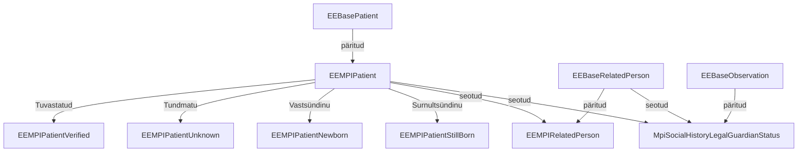

Patsiendi üldandmete teenus (PÜT) põhineb EEBase EEBasePatient, EEBaseRelatedPerson ja EEBaseObservation profiilidel.
Kasutame juurutusjuhendis teenuse kirjeldamiseks termineid "PÜT - patsiendi üldandmete teenus" ja "MPI - Master Patient Index", kuid peame nende all silmas sisuliselt sama teenust.

Väljavõte EE MPI profiilide sõltuvusgraafist:


## EEMPIPatient
Profiilid on vajalikud andmekoosseisude valideerimiseks. Selle eesmärgiga profiilid luuakse iga kasutusjuhu jaoks eraldi ja välditakse liiga üldiste profiilide kasutamist.

[EE MPI Patient](StructureDefinition-ee-mpi-patient.html) on abstraktne profiil, mille eesmärk on kirjeldada üldised MPI piirangud.

Võrreldes EEBase-iga ei toeta MPI: *maritalStatus*, *photo*, *contact*, *generalPractitioner*, *managingOrganization*	ja *link* elemente sisendina ja ei töötle neid kui neid edastatakse teenusele.
Samas pakub teenus patsientide [sidumise ja lahti sidumise](link.html) tegevusi ning sidumise tulemusi väljastab *link* elemendis.

Kasutusjuhu põhised patsiendi profiilid on 

| Profiil  | Kasutusjuht |
|---|---|
| [EEMPIPatientVerified](StructureDefinition-ee-mpi-patient-verified.html) | Dokumendi alusel tuvastatud patsiendi registreerimine |
| [EEMPIPatientUnknown](StructureDefinition-ee-mpi-patient-unknown.html) | Tundmatu või anaonüümse patsiendi registreerimine |
| [EEMPIPatientNewborn](StructureDefinition-ee-mpi-patient-newborn.html) | Vastsündinu patsiendi registreerimine (antud profiil realiseeritakse tulevikus) |
| [EEMPIPatientStillborn](StructureDefinition-ee-mpi-patient-stillborn.html) | Surnultsündinu patsiendi registreerimine (antud profiil realiseeritakse tulevikus) |

## Patsiendiga seotud töövood

```plantuml
scale 800 width

state "Patsientide nimekiri PÜTis" as MPIlist <<choice>>
note left of MPIlist: Patsientide nimekiri PÜTis
state "Puudub PÜT-is" as missingMPI
[*] -down-> MPIlist: "[[http://plantuml.com Eestimaalase otsing]].\nGET /Patient?identifier=value"

MPIlist --> Patsient : "Patsient leitud.\nGET /Patient/$id"
MPIlist --> missingMPI : "Patsient pole leitud või puudub"
state missingMPI {
  state "Patsiendid RR-is" as RRlist <<choice>>
  note left of RRlist: Patsiendid RR-is
  [*] --> RRlist: "Otsing RR-is.\nGET /Patient/$lookup?identifier=value"
  RRlist --> Patsient: "Patsient leitud.\nGET /Patient/$id"
}

state Patsient {
  Patsient --> Patsient: "Uuenda andmed.\nPUT /Patient/$id"
  [*] --> RelatedPerson: "Kontaktisikute\nhaldus"
  [*] --> MPIOperations: "Sotsiaalsed\nnäitajad"
}

Patsient --> [*] : Valmis
missingMPI --> [*] : "Puudub MPI-s.\nKatkestame"
RRlist --> [*]: "Puudub RR-s.\nKatkestame"
```
