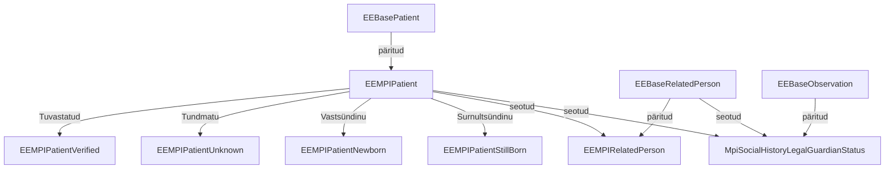
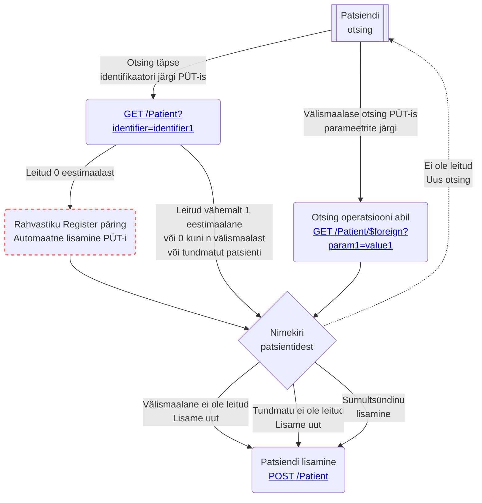

Patsiendi üldandmete teenus (PÜT) põhineb EEBase EEBasePatient, EEBaseRelatedPerson ja EEBaseObservation profiilidel.
Kasutame juurutusjuhendis teenuse kirjeldamiseks termineid "PÜT - patsiendi üldandmete teenus" ja "MPI - Master Patient Index", kuid peame nende all silmas
sisuliselt sama teenust.

Väljavõte EE MPI profiilide sõltuvusgraafist:



## EEMPIPatient

Profiilid on vajalikud andmekoosseisude valideerimiseks. Selle eesmärgiga profiilid luuakse iga kasutusjuhu jaoks eraldi ja välditakse liiga üldiste profiilide
kasutamist.

[EE MPI Patient](StructureDefinition-ee-mpi-patient.html) on abstraktne profiil, mille eesmärk on kirjeldada üldised MPI piirangud.

Võrreldes EEBase-iga ei toeta MPI: *maritalStatus*, *photo*, *contact*, *generalPractitioner*, *managingOrganization*    ja *link* elemente sisendina ja ei
töötle neid kui neid edastatakse teenusele.
Samas pakub teenus patsientide [sidumise ja lahti sidumise](link.html) tegevusi ning sidumise tulemusi väljastab *link* elemendis.

Kasutusjuhu põhised patsiendi profiilid on

| Profiil                                                                    | Kasutusjuht                                                                        |
|----------------------------------------------------------------------------|------------------------------------------------------------------------------------|
| [EEMPIPatientVerified](StructureDefinition-ee-mpi-patient-verified.html)   | Dokumendi alusel tuvastatud patsiendi registreerimine                              |
| [EEMPIPatientUnknown](StructureDefinition-ee-mpi-patient-unknown.html)     | Tundmatu või anaonüümse patsiendi registreerimine                                  |
| [EEMPIPatientNewborn](StructureDefinition-ee-mpi-patient-newborn.html)     | Vastsündinu patsiendi registreerimine (antud profiil realiseeritakse tulevikus)    |
| [EEMPIPatientStillborn](StructureDefinition-ee-mpi-patient-stillborn.html) | Surnultsündinu patsiendi registreerimine (antud profiil realiseeritakse tulevikus) |

## Patsiendi otsing

Järgmine diagramm annab ülevaate vajalikest sammudest patsiendi otsinguks:



### Otsingu komponent
> ⚠️ **NB:** Tegemist on otsingu realiseerimise näidisega.


Paljudes tarkvarades on kasutusel patsiendi otsing ühe otsingu väljaga (Google stiilis). Et vältida liigsete andmete pärimist, kuna PÜT lisab kõik leitud
patsiendid auditlogisse, soovitame ühtlustada ühe väljaga otsingut vastavalt allpoolt toodud kirjeldusele.

Allpool toodud pilt visualiseerib mõned otsingunäited: 1) otsing Eesti isikukoodiga; 2) välismaalase otsing, kus riigiks on määratud Portugal, perekonnanimi on
Ronaldo, eesnimi on Cristiano ja sünnikuupäev on 05.02.1985; 3) tundmatu otsing.

```drawio
PD94bWwgdmVyc2lvbj0iMS4wIiBlbmNvZGluZz0iVVRGLTgiPz4KICAgICAgPCFET0NUWVBFIHN2ZyBQVUJMSUMgIi0vL1czQy8vRFREIFNWRyAxLjEvL0VOIiAiaHR0cDovL3d3dy53My5vcmcvR3JhcGhpY3MvU1ZHLzEuMS9EVEQvc3ZnMTEuZHRkIj4KICAgICAgPHN2ZyB4bWxucz0iaHR0cDovL3d3dy53My5vcmcvMjAwMC9zdmciIHhtbG5zOnhsaW5rPSJodHRwOi8vd3d3LnczLm9yZy8xOTk5L3hsaW5rIiB2ZXJzaW9uPSIxLjEiIHdpZHRoPSIyODdweCIgaGVpZ2h0PSIxMjdweCIgdmlld0JveD0iLTAuNSAtMC41IDI4NyAxMjciIGNvbnRlbnQ9IiZsdDtteGZpbGUgaG9zdD0mcXVvdDtlbWJlZC5kaWFncmFtcy5uZXQmcXVvdDsgbW9kaWZpZWQ9JnF1b3Q7MjAyNC0wMi0xNFQxNTo0NjoxMi4wODBaJnF1b3Q7IGFnZW50PSZxdW90O01vemlsbGEvNS4wIChNYWNpbnRvc2g7IEludGVsIE1hYyBPUyBYIDEwXzE1XzcpIEFwcGxlV2ViS2l0LzYwNS4xLjE1IChLSFRNTCwgbGlrZSBHZWNrbykgVmVyc2lvbi8xNy4yLjEgU2FmYXJpLzYwNS4xLjE1JnF1b3Q7IGV0YWc9JnF1b3Q7LWJ2UW04SjRscGFyVzV4RjJkU2YmcXVvdDsgdmVyc2lvbj0mcXVvdDsyMy4xLjQmcXVvdDsgdHlwZT0mcXVvdDtlbWJlZCZxdW90OyZndDsmbHQ7ZGlhZ3JhbSBpZD0mcXVvdDt6VENhb204Y0VvNVhYNWZyZFdPTCZxdW90OyBuYW1lPSZxdW90O1BhZ2UtMSZxdW90OyZndDs1VmhSYjVzd0VQNDF2RmJZQmhJZXN6VHRLbTF0bFhUYXN3czNzQVFZT1U1STl1dG5naDNpbXExUkcyWForb1R2OHgzbSsrNjRFM2hrV201dUJhM3pyenlGd3NOK3V2SEl0WWN4OHJHdkxpMnk3WkJvcElGTXNGUTc5Y0NDL1FRVHFkRVZTMkZwT1VyT0M4bHFHMHg0VlVFaUxZd0t3UnZiN1FjdjdGTnJtb0VETEJKYXVPaDNsc3E4UThkNDFPT2ZnV1c1T1JsRmNiZFRVdU9zbVN4em12TG1BQ0l6ajB3RjU3SmJsWnNwRksxNFJwY3U3dVkzdS9zSEUxREpZd0p3RjdDbXhVcHpDK0xBSjRoRUlRcTlOamlpWmUyUlQ5WHpzcjM4NjlCTGU1Y0R1VFdKRlh4VnBkQnFnOVIya3pNSmk1b203VzZqU2xsaHVTd0x2ZTFxcmVWZmc1Q3dPWUMwOXJmQVM1QmlxMXpNTHRGMW9GK0VVSnROWDFYWXZCdjVRVVVGR3FPNmtMUDluZnRjcTRWTzkzRHFpWlA2MmVMcFdCM2ZveHN0V0ZhcGRhSjBBM0VxSVNOYnlKRWpaQkM0T3VMdy9Ub0dqbzZPUEpuU3B6NmU1YjV4MFdkekIvL1A3RTEvMmZkVGw3MUwvZ1RjdzllNVE1Vk8ycGFycklwWFlKZENYemUrc3BUckRXdlAybG11WHBvRHBGWjNkbFU1b0IwT3ZEd0dFMUJReWRaMlR4OVNRNS93eUpsNmtyN0U3SUFsWDRrRXRNOWh4elZoRzR1RUNaTlVaQ0Nkc0ozd2UwcEg1U0w2aUxsNG8vckRLVHhkTGtZRHVmajd3MjhJbWovY1Q3NWNQM2hZY2ZLbjg3dkYwOTNrL2x0bit1R1ZqNjlRUEE0dmJsQWlmTVpKT1hheStUai9ieVlsd3VjYmxmSGxqVXBFempVcnpjZkxtUnAwZkJrTitrS0hKVUlmTVJtWE1TMlYyWC9nZHU3OWJ3SXkrd1U9Jmx0Oy9kaWFncmFtJmd0OyZsdDsvbXhmaWxlJmd0OyIgc3R5bGU9ImJhY2tncm91bmQtY29sb3I6IHJnYigyNTUsIDI1NSwgMjU1KTsiPjxkZWZzLz48cmVjdCBmaWxsPSIjZmZmIiB3aWR0aD0iMTAwJSIgaGVpZ2h0PSIxMDAlIiB4PSIwIiB5PSIwIi8+PGc+PHJlY3QgeD0iOCIgeT0iOCIgd2lkdGg9IjI3MCIgaGVpZ2h0PSI0MCIgcng9IjYiIHJ5PSI2IiBmaWxsPSJyZ2IoMjU1LCAyNTUsIDI1NSkiIHN0cm9rZT0icmdiKDAsIDAsIDApIiBwb2ludGVyLWV2ZW50cz0iYWxsIi8+PGcgdHJhbnNmb3JtPSJ0cmFuc2xhdGUoLTAuNSAtMC41KSI+PHN3aXRjaD48Zm9yZWlnbk9iamVjdCBwb2ludGVyLWV2ZW50cz0ibm9uZSIgd2lkdGg9IjEwMCUiIGhlaWdodD0iMTAwJSIgcmVxdWlyZWRGZWF0dXJlcz0iaHR0cDovL3d3dy53My5vcmcvVFIvU1ZHMTEvZmVhdHVyZSNFeHRlbnNpYmlsaXR5IiBzdHlsZT0ib3ZlcmZsb3c6IHZpc2libGU7IHRleHQtYWxpZ246IGxlZnQ7Ij48ZGl2IHhtbG5zPSJodHRwOi8vd3d3LnczLm9yZy8xOTk5L3hodG1sIiBzdHlsZT0iZGlzcGxheTogZmxleDsgYWxpZ24taXRlbXM6IHVuc2FmZSBjZW50ZXI7IGp1c3RpZnktY29udGVudDogdW5zYWZlIGNlbnRlcjsgd2lkdGg6IDI2OHB4OyBoZWlnaHQ6IDFweDsgcGFkZGluZy10b3A6IDI4cHg7IG1hcmdpbi1sZWZ0OiA5cHg7Ij48ZGl2IGRhdGEtZHJhd2lvLWNvbG9ycz0iY29sb3I6IHJnYigwLCAwLCAwKTsgIiBzdHlsZT0iYm94LXNpemluZzogYm9yZGVyLWJveDsgZm9udC1zaXplOiAwcHg7IHRleHQtYWxpZ246IGNlbnRlcjsiPjxkaXYgc3R5bGU9ImRpc3BsYXk6IGlubGluZS1ibG9jazsgZm9udC1zaXplOiAxMnB4OyBmb250LWZhbWlseTogSGVsdmV0aWNhOyBjb2xvcjogcmdiKDAsIDAsIDApOyBsaW5lLWhlaWdodDogMS4yOyBwb2ludGVyLWV2ZW50czogYWxsOyB3aGl0ZS1zcGFjZTogbm9ybWFsOyBvdmVyZmxvdy13cmFwOiBub3JtYWw7Ij40OTQwMzEzNjUxNSDCoCDCoCDCoCDCoCDCoCDCoCDCoCDCoCDCoCDCoCDCoMKgPC9kaXY+PC9kaXY+PC9kaXY+PC9mb3JlaWduT2JqZWN0Pjx0ZXh0IHg9IjE0MyIgeT0iMzIiIGZpbGw9InJnYigwLCAwLCAwKSIgZm9udC1mYW1pbHk9IkhlbHZldGljYSIgZm9udC1zaXplPSIxMnB4IiB0ZXh0LWFuY2hvcj0ibWlkZGxlIj40OTQwMzEzNjUxNSDCoCDCoCDCoCDCoCDCoCDCoCDCoCDCoCDCoCDCoCDCoMKgPC90ZXh0Pjwvc3dpdGNoPjwvZz48cmVjdCB4PSIxNCIgeT0iMTUiIHdpZHRoPSI0NCIgaGVpZ2h0PSIyNSIgcng9IjMuNzUiIHJ5PSIzLjc1IiBmaWxsPSJyZ2IoMjU1LCAyNTUsIDI1NSkiIHN0cm9rZT0icmdiKDAsIDAsIDApIiBwb2ludGVyLWV2ZW50cz0iYWxsIi8+PGcgdHJhbnNmb3JtPSJ0cmFuc2xhdGUoLTAuNSAtMC41KSI+PHN3aXRjaD48Zm9yZWlnbk9iamVjdCBwb2ludGVyLWV2ZW50cz0ibm9uZSIgd2lkdGg9IjEwMCUiIGhlaWdodD0iMTAwJSIgcmVxdWlyZWRGZWF0dXJlcz0iaHR0cDovL3d3dy53My5vcmcvVFIvU1ZHMTEvZmVhdHVyZSNFeHRlbnNpYmlsaXR5IiBzdHlsZT0ib3ZlcmZsb3c6IHZpc2libGU7IHRleHQtYWxpZ246IGxlZnQ7Ij48ZGl2IHhtbG5zPSJodHRwOi8vd3d3LnczLm9yZy8xOTk5L3hodG1sIiBzdHlsZT0iZGlzcGxheTogZmxleDsgYWxpZ24taXRlbXM6IHVuc2FmZSBjZW50ZXI7IGp1c3RpZnktY29udGVudDogdW5zYWZlIGNlbnRlcjsgd2lkdGg6IDQycHg7IGhlaWdodDogMXB4OyBwYWRkaW5nLXRvcDogMjhweDsgbWFyZ2luLWxlZnQ6IDE1cHg7Ij48ZGl2IGRhdGEtZHJhd2lvLWNvbG9ycz0iY29sb3I6IHJnYigwLCAwLCAwKTsgIiBzdHlsZT0iYm94LXNpemluZzogYm9yZGVyLWJveDsgZm9udC1zaXplOiAwcHg7IHRleHQtYWxpZ246IGNlbnRlcjsiPjxkaXYgc3R5bGU9ImRpc3BsYXk6IGlubGluZS1ibG9jazsgZm9udC1zaXplOiAxMnB4OyBmb250LWZhbWlseTogSGVsdmV0aWNhOyBjb2xvcjogcmdiKDAsIDAsIDApOyBsaW5lLWhlaWdodDogMS4yOyBwb2ludGVyLWV2ZW50czogYWxsOyB3aGl0ZS1zcGFjZTogbm9ybWFsOyBvdmVyZmxvdy13cmFwOiBub3JtYWw7Ij5FU1QgwqAgwqA8L2Rpdj48L2Rpdj48L2Rpdj48L2ZvcmVpZ25PYmplY3Q+PHRleHQgeD0iMzYiIHk9IjMxIiBmaWxsPSJyZ2IoMCwgMCwgMCkiIGZvbnQtZmFtaWx5PSJIZWx2ZXRpY2EiIGZvbnQtc2l6ZT0iMTJweCIgdGV4dC1hbmNob3I9Im1pZGRsZSI+RVNUIMKgIMKgPC90ZXh0Pjwvc3dpdGNoPjwvZz48cGF0aCBkPSJNIDQ3IDMwIEwgNTEgMjUiIGZpbGw9Im5vbmUiIHN0cm9rZT0icmdiKDAsIDAsIDApIiBzdHJva2UtbWl0ZXJsaW1pdD0iMTAiIHBvaW50ZXItZXZlbnRzPSJzdHJva2UiLz48cGF0aCBkPSJNIDQ3IDI1IEwgNTEgMzAiIGZpbGw9Im5vbmUiIHN0cm9rZT0icmdiKDAsIDAsIDApIiBzdHJva2UtbWl0ZXJsaW1pdD0iMTAiIHBvaW50ZXItZXZlbnRzPSJzdHJva2UiLz48cmVjdCB4PSI4IiB5PSI3OCIgd2lkdGg9IjI3MCIgaGVpZ2h0PSI0MCIgcng9IjYiIHJ5PSI2IiBmaWxsPSJyZ2IoMjU1LCAyNTUsIDI1NSkiIHN0cm9rZT0icmdiKDAsIDAsIDApIiBwb2ludGVyLWV2ZW50cz0iYWxsIi8+PGcgdHJhbnNmb3JtPSJ0cmFuc2xhdGUoLTAuNSAtMC41KSI+PHN3aXRjaD48Zm9yZWlnbk9iamVjdCBwb2ludGVyLWV2ZW50cz0ibm9uZSIgd2lkdGg9IjEwMCUiIGhlaWdodD0iMTAwJSIgcmVxdWlyZWRGZWF0dXJlcz0iaHR0cDovL3d3dy53My5vcmcvVFIvU1ZHMTEvZmVhdHVyZSNFeHRlbnNpYmlsaXR5IiBzdHlsZT0ib3ZlcmZsb3c6IHZpc2libGU7IHRleHQtYWxpZ246IGxlZnQ7Ij48ZGl2IHhtbG5zPSJodHRwOi8vd3d3LnczLm9yZy8xOTk5L3hodG1sIiBzdHlsZT0iZGlzcGxheTogZmxleDsgYWxpZ24taXRlbXM6IHVuc2FmZSBjZW50ZXI7IGp1c3RpZnktY29udGVudDogdW5zYWZlIGNlbnRlcjsgd2lkdGg6IDI2OHB4OyBoZWlnaHQ6IDFweDsgcGFkZGluZy10b3A6IDk4cHg7IG1hcmdpbi1sZWZ0OiA5cHg7Ij48ZGl2IGRhdGEtZHJhd2lvLWNvbG9ycz0iY29sb3I6IHJnYigwLCAwLCAwKTsgIiBzdHlsZT0iYm94LXNpemluZzogYm9yZGVyLWJveDsgZm9udC1zaXplOiAwcHg7IHRleHQtYWxpZ246IGNlbnRlcjsiPjxkaXYgc3R5bGU9ImRpc3BsYXk6IGlubGluZS1ibG9jazsgZm9udC1zaXplOiAxMnB4OyBmb250LWZhbWlseTogSGVsdmV0aWNhOyBjb2xvcjogcmdiKDAsIDAsIDApOyBsaW5lLWhlaWdodDogMS4yOyBwb2ludGVyLWV2ZW50czogYWxsOyB3aGl0ZS1zcGFjZTogbm9ybWFsOyBvdmVyZmxvdy13cmFwOiBub3JtYWw7Ij7CoCDCoCDCoCDCoCDCoCDCoCDCoCDCoCBST05BTERPLCBDUklTVElBTlUsIDA1LjAyLjE5ODU8L2Rpdj48L2Rpdj48L2Rpdj48L2ZvcmVpZ25PYmplY3Q+PHRleHQgeD0iMTQzIiB5PSIxMDIiIGZpbGw9InJnYigwLCAwLCAwKSIgZm9udC1mYW1pbHk9IkhlbHZldGljYSIgZm9udC1zaXplPSIxMnB4IiB0ZXh0LWFuY2hvcj0ibWlkZGxlIj7CoCDCoCDCoCDCoCDCoCDCoCDCoCDCoCBST05BTERPLCBDUklTVElBTlUsIDA1LjAyLjE5ODU8L3RleHQ+PC9zd2l0Y2g+PC9nPjxyZWN0IHg9IjE0IiB5PSI4NSIgd2lkdGg9IjQ0IiBoZWlnaHQ9IjI1IiByeD0iMy43NSIgcnk9IjMuNzUiIGZpbGw9InJnYigyNTUsIDI1NSwgMjU1KSIgc3Ryb2tlPSJyZ2IoMCwgMCwgMCkiIHBvaW50ZXItZXZlbnRzPSJhbGwiLz48ZyB0cmFuc2Zvcm09InRyYW5zbGF0ZSgtMC41IC0wLjUpIj48c3dpdGNoPjxmb3JlaWduT2JqZWN0IHBvaW50ZXItZXZlbnRzPSJub25lIiB3aWR0aD0iMTAwJSIgaGVpZ2h0PSIxMDAlIiByZXF1aXJlZEZlYXR1cmVzPSJodHRwOi8vd3d3LnczLm9yZy9UUi9TVkcxMS9mZWF0dXJlI0V4dGVuc2liaWxpdHkiIHN0eWxlPSJvdmVyZmxvdzogdmlzaWJsZTsgdGV4dC1hbGlnbjogbGVmdDsiPjxkaXYgeG1sbnM9Imh0dHA6Ly93d3cudzMub3JnLzE5OTkveGh0bWwiIHN0eWxlPSJkaXNwbGF5OiBmbGV4OyBhbGlnbi1pdGVtczogdW5zYWZlIGNlbnRlcjsganVzdGlmeS1jb250ZW50OiB1bnNhZmUgY2VudGVyOyB3aWR0aDogNDJweDsgaGVpZ2h0OiAxcHg7IHBhZGRpbmctdG9wOiA5OHB4OyBtYXJnaW4tbGVmdDogMTVweDsiPjxkaXYgZGF0YS1kcmF3aW8tY29sb3JzPSJjb2xvcjogcmdiKDAsIDAsIDApOyAiIHN0eWxlPSJib3gtc2l6aW5nOiBib3JkZXItYm94OyBmb250LXNpemU6IDBweDsgdGV4dC1hbGlnbjogY2VudGVyOyI+PGRpdiBzdHlsZT0iZGlzcGxheTogaW5saW5lLWJsb2NrOyBmb250LXNpemU6IDEycHg7IGZvbnQtZmFtaWx5OiBIZWx2ZXRpY2E7IGNvbG9yOiByZ2IoMCwgMCwgMCk7IGxpbmUtaGVpZ2h0OiAxLjI7IHBvaW50ZXItZXZlbnRzOiBhbGw7IHdoaXRlLXNwYWNlOiBub3JtYWw7IG92ZXJmbG93LXdyYXA6IG5vcm1hbDsiPlBSVCDCoCDCoDwvZGl2PjwvZGl2PjwvZGl2PjwvZm9yZWlnbk9iamVjdD48dGV4dCB4PSIzNiIgeT0iMTAxIiBmaWxsPSJyZ2IoMCwgMCwgMCkiIGZvbnQtZmFtaWx5PSJIZWx2ZXRpY2EiIGZvbnQtc2l6ZT0iMTJweCIgdGV4dC1hbmNob3I9Im1pZGRsZSI+UFJUIMKgIMKgPC90ZXh0Pjwvc3dpdGNoPjwvZz48cGF0aCBkPSJNIDQ3IDEwMCBMIDUxIDk1IiBmaWxsPSJub25lIiBzdHJva2U9InJnYigwLCAwLCAwKSIgc3Ryb2tlLW1pdGVybGltaXQ9IjEwIiBwb2ludGVyLWV2ZW50cz0ic3Ryb2tlIi8+PHBhdGggZD0iTSA0NyA5NSBMIDUxIDEwMCIgZmlsbD0ibm9uZSIgc3Ryb2tlPSJyZ2IoMCwgMCwgMCkiIHN0cm9rZS1taXRlcmxpbWl0PSIxMCIgcG9pbnRlci1ldmVudHM9InN0cm9rZSIvPjwvZz48c3dpdGNoPjxnIHJlcXVpcmVkRmVhdHVyZXM9Imh0dHA6Ly93d3cudzMub3JnL1RSL1NWRzExL2ZlYXR1cmUjRXh0ZW5zaWJpbGl0eSIvPjxhIHRyYW5zZm9ybT0idHJhbnNsYXRlKDAsLTUpIiB4bGluazpocmVmPSJodHRwczovL3d3dy5kcmF3aW8uY29tL2RvYy9mYXEvc3ZnLWV4cG9ydC10ZXh0LXByb2JsZW1zIiB0YXJnZXQ9Il9ibGFuayI+PHRleHQgdGV4dC1hbmNob3I9Im1pZGRsZSIgZm9udC1zaXplPSIxMHB4IiB4PSI1MCUiIHk9IjEwMCUiPlRleHQgaXMgbm90IFNWRyAtIGNhbm5vdCBkaXNwbGF5PC90ZXh0PjwvYT48L3N3aXRjaD48L3N2Zz4=
```

Liigsete andmete pärimise vältimiseks soovitame lisada otsingukomponendi sisse
täiendava filtri.

- Lihtsama implementatatsiooni puhul selleks võiks olla valik riikidest, PÜT tundmatu patsiendi identifikaatorist ja oma asutuse patsiendi identifikaatorist.
- Keerulisem lahendus peaks arvestama [Patsiendi identifikaatorite domeen](https://akk.tehik.ee/classifier/resources/value-sets/patsiendi-identifikaatorite-domeen/summary) loendiga
  ja [Isikute ja asutuste identifikaatorite domeen](https://akk.tehik.ee/classifier/resources/code-systems/identifikaatorite-domeen/summary) koodisüsteemi ülesehitusega. Iga loendi kuuluv mõiste
  omab tunnust `country` (riik), ning kõik kasutamiseks lubatud mõisted (`notSelectable`=false) omavad `idtype` (identifitseerimise viis). Iga riigiga on seotud
  erinev arv identifitseerimisviise. Näiteks on Saksamaalt pärit patsiente lubatud identifitseerida ainult passinumbri põhjal, kuid Soome patsiente saab
  identifitseerida isikliku identifikaatori, passinumbri ja ID-kaardi numbri alusel. Arendajal on vabadus kasutada kas hierarhiat või kahte valikut (riik ja
  identifitseerimisviis) või oma lahendust, oluline on, et päring PÜT-ile tehakse koos identifitseerimissüsteemiga (nt Soome
  isikukoodiga `https://fhir.ee/sid/pid/fin/ni`).

> PS. Oluline on meeles pidada, et on olemas riigid, kus kõik dokumendid sisaldavad riiklikku isiklikku
> identifikaatorit (süsteemiga https://fhir.ee/sid/pid/***/ni). Vastava riigi patsiendi lisamisel on riikliku personaalse identifikaatori kasutamine kohustuslik.”

Allpool on kirjeldatud erinevad otsingukomponendi päringud:

1) kui otsingutekst koosneb ühest sõnest ja selles esinevad numbrid, siis on tegemist identifikaatori või dokumendi numbriga. Sel juhul tuleb teostada päring
   täpse identifikaatori järgi.

Otsing Eesti isikukoodi järgi:

```
Otsingu tekst: EST | 49403136515
FHIR päring: GET /Patient?identifier=https://fhir.ee/sid/pid/est/ni|49403136515
```

Otsing suvalise USA dokumendi numbri järgi:

```
Otsingu tekst: USA | E00007734
FHIR päring: GET /Patient?identifier=https://fhir.ee/sid/pid/usa|E00007734
```

Otsing USA passinumbri järgi:

```
Otsingu tekst: USA | E00007734
FHIR päring: GET /Patient?identifier=https://fhir.ee/sid/pid/usa/ppn|E00007734
```

2) kui otsingutekst koosneb ainult tähtedest või sisaldab eraldajaid (koma või tühik), siis on tegemist tekstiga, mis sisaldab nime. Antud tekst võib sisaldada
   komponente nagu *perekonnanimi*, *eesnimi* ja *sünnikuupäev* (kõik toetatud otsinguparameetrid on toodud [siin](operations.html#välismaalaste-otsing)) 

```
Otsingu tekst: PRT | RONALDO, CRISTIANU, 05.02.1985
FHIR päring: GET /Patient/$foreign?identifier_country=PRT&family=RONALDO&given=CRISTIANU&birthdate=1985-02-05
```

```
Otsingu tekst: PRT | RONALDO, CRISTIANU
FHIR päring: GET /Patient/$foreign?identifier_country=PRT&family=RONALDO&given=CRISTIANU
```

```
Otsingu tekst: PRT | RONALDO
FHIR päring: GET /Patient/$foreign?identifier_country=PRT&family=RONALDO
```

```
Otsingu tekst: PRT | RONALDO,, 05.02.1985
FHIR päring: GET /Patient/$foreign?identifier_country=PRT&family=RONALDO&birthdate=1985-02-05
```

3) Tundmatu või anonüümse või tuvastamata patsiendi otsing.

Tundmatu, anonüümsete või tuvastamata patsientide käsitlemiseks, loend riikidest peaks sisaldama väärtust PÜT (või MPI) ja haigla lühendi.

PÜT-i poolt genereeritud identifikaator koosneb sidekripsuga ühendatud numbritest ja tähtedest ([UUID](https://www.javatpoint.com/java-uuid) vormingus)

Otsing tundmatu patsiendi identifikaatori järgi:

```
Otsingu tekst: PÜT | 237e9877-e79b-12d4-a765-321741963000
FHIR päring: GET /Patient?identifier=https://fhir.ee/sid/pid/est/mr|237e9877-e79b-12d4-a765-321741963000
```

TTO võib genereerida oma tundmatu numbri enda valitud vormingus. Sellise numbri saatmiseks või pärimiseks tuleb kasutada oma nimeruumi.

NB! TEHIK soovitab kasutada ainult PÜT-i poolt genereeritud tundmatu identifikaatorit.

Otsing PERHi tundmatu patsiendi identifikaatori järgi:

```
Otsingu tekst: PERH | 1234567
FHIR päring: GET /Patient?identifier=https://fhir.ee/sid/pid/est/prn/90006399|1234567
```

## Ärianalüüs

- [Analüüsiraport](Patsientide_yldandmete_teenuse_protsessi_analyys.pdf)
- [PÜT andmekirjeldus](PYT-andmekirjeldus_2024-04-01.pdf)

